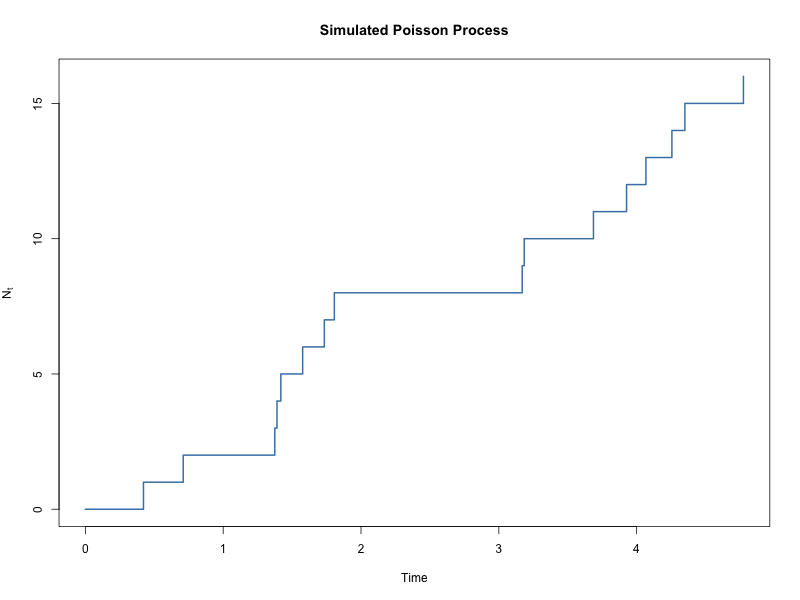
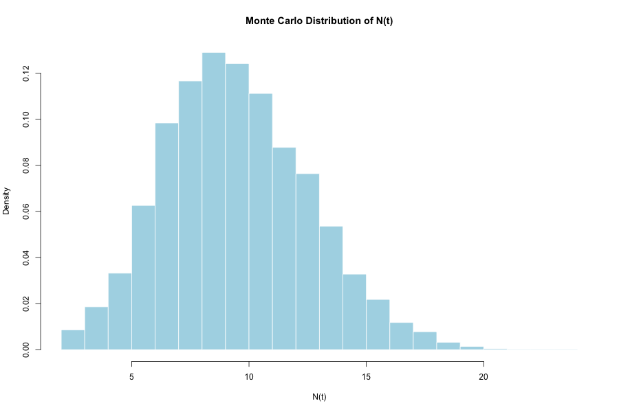
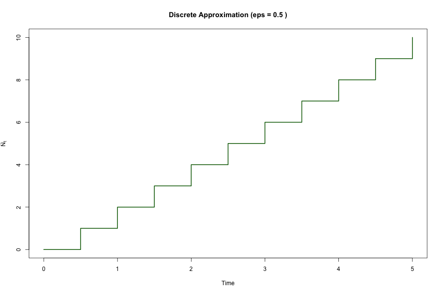
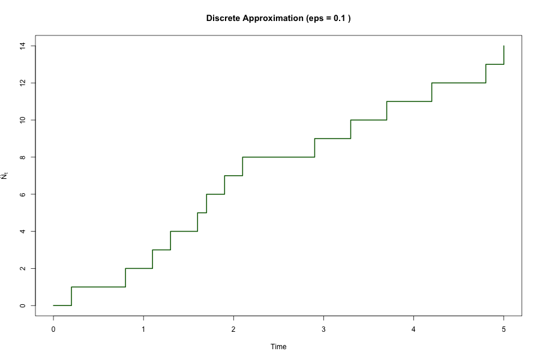
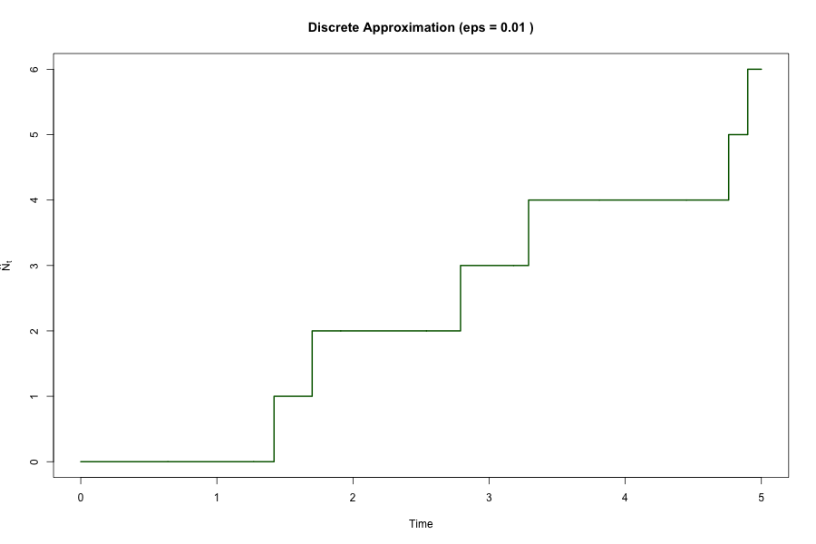
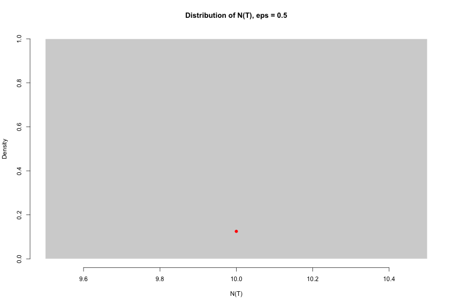
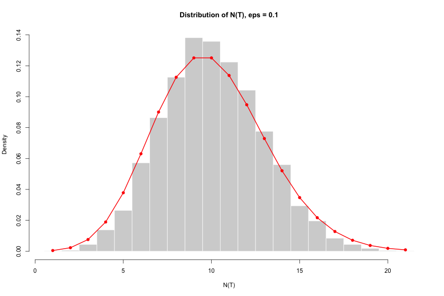
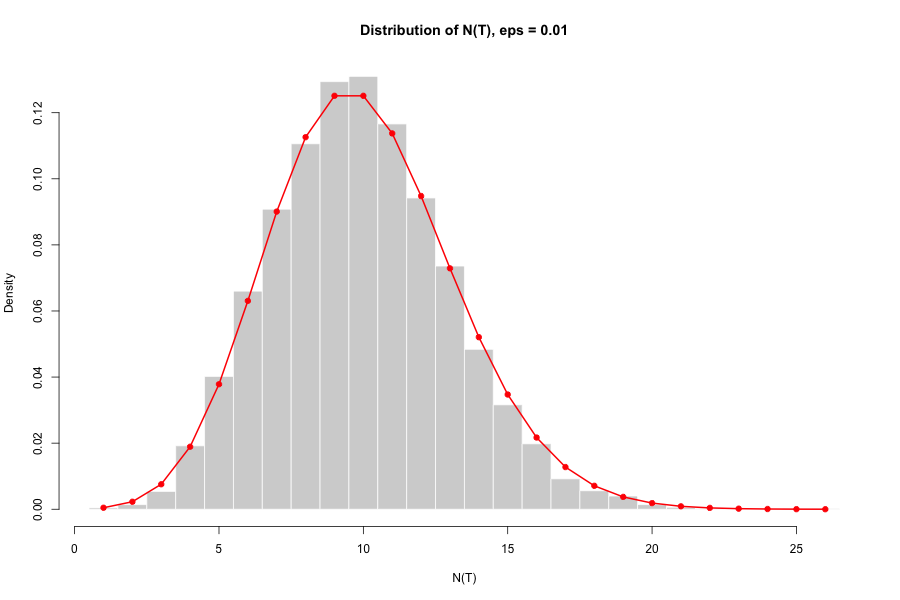
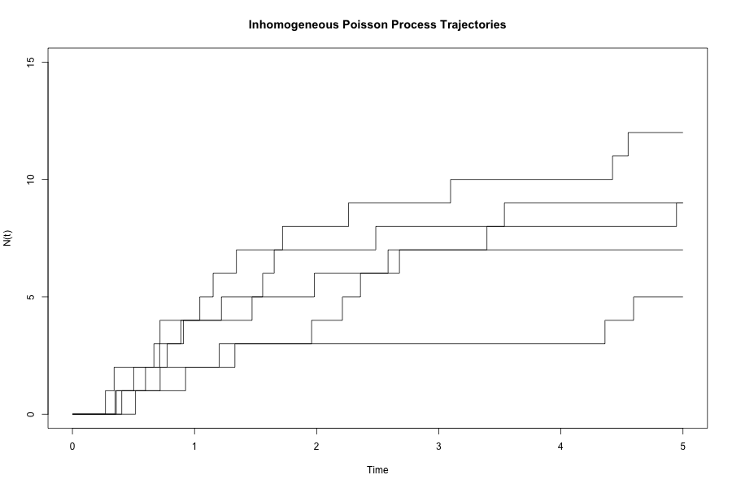
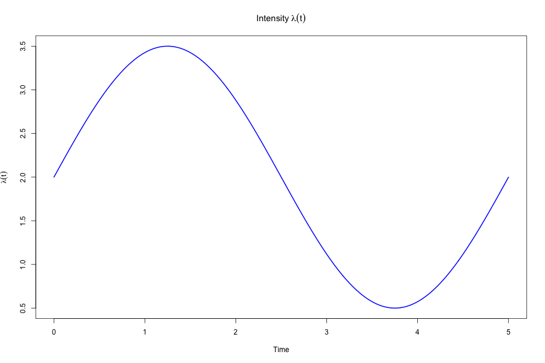

# Simulation and Statistical Properties of Poisson Processes

## Overview

This repository explores simulation, approximation, and statistical validation of Poisson processes using computational stochastic modelling in R.

The project investigates:
- homogeneous Poisson processes,
- exponential waiting times,
- Monte Carlo validation,
- discrete-time approximations,
- inhomogeneous Poisson processes,
- thinning algorithms,
- stochastic event dynamics.

Applications to quantitative finance, queueing systems, and stochastic simulation are discussed throughout.

---

# Experiment 1 — Simulating Homogeneous Poisson Trajectories

## Motivation

Poisson processes are fundamental stochastic models for random event arrivals.

They appear in:
- queueing systems,
- communication networks,
- reliability modelling,
- transaction arrivals,
- market microstructure,
- jump-diffusion models in quantitative finance.

The objective of this experiment is to simulate sample trajectories of a homogeneous Poisson process and investigate its core statistical properties.

---

## Theory

A homogeneous Poisson process with intensity λ satisfies:

- independent increments,
- exponentially distributed waiting times,
- stationary jump behaviour.

For a fixed time t:

- E[N(t)] = λt
- Var(N(t)] = λt

The waiting times between jumps follow an exponential distribution with mean:

- E[T] = 1/λ

---

## Simulation Methodology

The simulation is constructed directly from exponential waiting times.

At each step:
1. Generate an exponential waiting time.
2. Advance the clock.
3. Increase the counting process by one jump.
4. Repeat until the terminal time horizon is reached.

This produces the characteristic staircase trajectory of the Poisson counting process.

---

## Simulated Trajectory

---

## Waiting Time Analysis

The empirical waiting times are compared against the theoretical exponential waiting-time distribution.

---

# Experiment 2 — Monte Carlo Validation of Poisson Moments

## Objective

Monte Carlo simulation was used to empirically validate theoretical properties of the Poisson distribution.

The experiment investigates:
- empirical convergence of the mean,
- empirical convergence of the variance,
- variability across trajectories,
- distributional behaviour of N(t).

---

## Monte Carlo Distribution of N(t)

---

## Observations

The empirical mean and variance converge closely toward the theoretical values predicted by the Poisson model.

This illustrates:
- stochastic variability across trajectories,
- convergence of empirical moments,
- consistency of the simulation procedure.

---

# Experiment 3 — Discrete-Time Approximation of Poisson Processes

## Motivation

Continuous-time Poisson processes can be approximated using discrete Bernoulli jump models.

This experiment investigates:
- trajectory convergence,
- distributional convergence,
- empirical moment convergence,
- dependence on discretization scale ε.

The approximation becomes increasingly accurate as ε decreases.

---

## Approximation Method

The interval [0,T] is discretized into small intervals of width ε.

At each interval:
- a jump occurs with probability λε,
- otherwise the process remains unchanged.

As ε → 0, the discrete process converges toward the continuous-time Poisson process.

---

## Trajectory Convergence

### ε = 0.5

### ε = 0.1

### ε = 0.01

---

## Distributional Convergence

### Distribution for ε = 0.5

### Distribution for ε = 0.1

### Distribution for ε = 0.01

---

## Observations

As ε decreases:
- trajectories increasingly resemble continuous-time Poisson paths,
- empirical moments converge toward theoretical values,
- the empirical distribution approaches the theoretical Poisson distribution.

This experiment illustrates convergence of discrete stochastic systems toward continuous-time jump processes.

---

# Experiment 4 — Inhomogeneous Poisson Processes via Thinning

## Motivation

Many stochastic systems exhibit time-varying event intensity.

This experiment investigates:
- non-homogeneous event arrivals,
- intensity-driven clustering,
- stochastic thinning algorithms,
- empirical trajectory variability.

Applications include:
- transaction flow modelling,
- varying market activity,
- high-frequency event timing,
- stochastic point-process systems.

---

## Thinning Algorithm

A homogeneous Poisson process with sufficiently large intensity M is first simulated.

Candidate events are then accepted with probability:

- λ(t)/M

This produces a non-homogeneous Poisson process with time-varying intensity λ(t).

---

## Simulated Trajectories

---

## Intensity Function

---

## Observations

The trajectories cluster more heavily in regions where λ(t) is large.

This demonstrates how stochastic event intensity directly influences jump frequency and temporal clustering behaviour.

## Financial Connection

Poisson processes are foundational in quantitative finance for modelling:
- market order arrivals,
- transaction flow,
- jump events,
- high-frequency event timing,
- stochastic jump-diffusion systems.

They also form the basis for more advanced stochastic point-process models used in market microstructure research.

